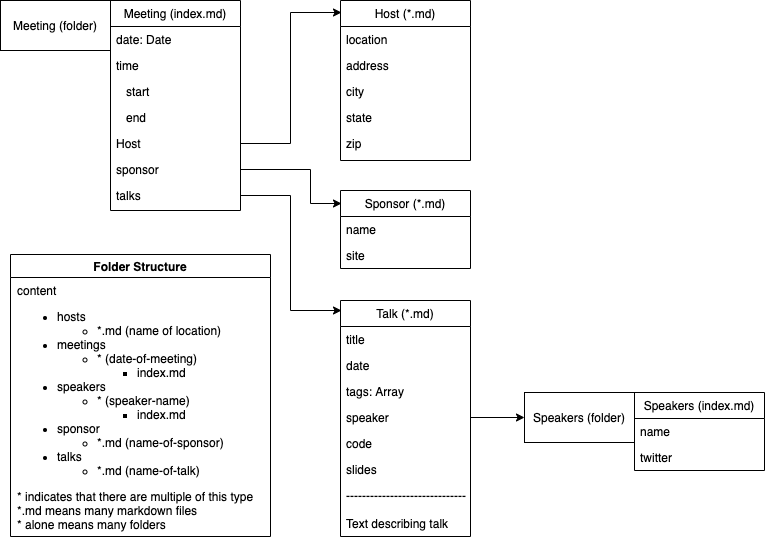

# Content Structure

In this folder you will find content for the following:
* [meetings](https://github.com/dsmjs/site/tree/master/content/meetings)
* [talks](https://github.com/dsmjs/site/tree/master/content/talks)
* [speakers](https://github.com/dsmjs/site/tree/master/content/speakers)
* [hosts](https://github.com/dsmjs/site/tree/master/content/hosts)
* [sponsors](https://github.com/dsmjs/site/tree/master/content/sponsors)

They are organized by the following structure:

